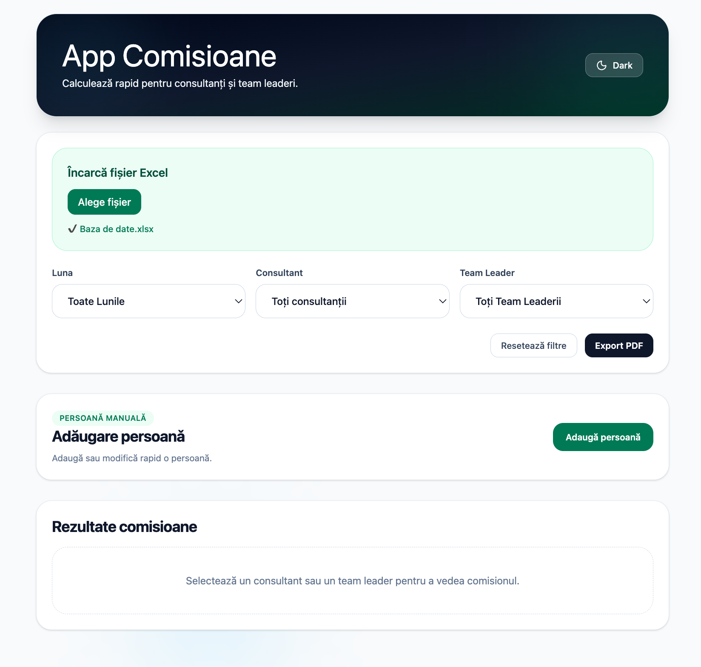

# 🧾 App Comisioane Thermomix

Aplicație web pentru calculul rapid al comisioanelor consultanților și team leaderilor, pe baza unui fișier Excel.

---

## 📸 Preview

## 

---

## 🌐 Demo
https://commissions-dashboard-three.vercel.app/

---

## 🚀 Funcționalități

- 📂 Upload fișier Excel (.xlsx, .xls, .csv)
- 📊 Calcul automat comisioane (TM6, accesorii, demo/delivery)
- 🔎 Filtrare după lună, consultant și team leader
- ➕ Adăugare manuală persoane
- ✏️ Editare / ștergere persoane manuale
- 📄 Export PDF rezultate
- 🌙 Dark mode
- 🔔 Feedback utilizator (toast notifications)

---

## 🛠️ Tehnologii folosite

- React (Hooks: useState, useEffect, custom hooks)
- Tailwind CSS
- XLSX
- jsPDF + autotable
- react-hot-toast
- Vite

---

## 📁 Structura proiectului

src/
components/
hooks/
utils/
constants/
layout/

---

## ⚙️ Instalare și rulare

git clone <repo-url>
cd app-thermomix
npm install
npm run dev

Aplicația va rula pe: http://localhost:5173

---

## 🧠 Cum funcționează

1. Se încarcă un fișier Excel
2. Datele sunt procesate
3. Se calculează comisioanele
4. Se aplică filtre
5. Se afișează rezultatele
6. Se pot adăuga persoane manual
7. Se poate exporta PDF

---

## ⚠️ Validări

- Numele este obligatoriu
- Valorile sunt convertite corect
- Datele lipsă devin 0

---

## 📌 Îmbunătățiri viitoare

- separare error state
- salvare în backend
- autentificare
- grafice

---

## 👩‍💻 Autor

Ioana Cazan
